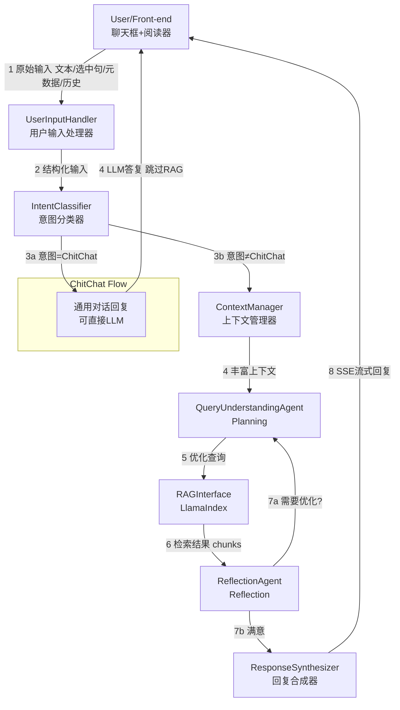

# 书籍RAG系统 - 增强的上下文感知与RAG查询优化设计方案

## 功能概述

本文档详细描述了书籍RAG系统中"增强的上下文感知与RAG查询优化"功能的技术方案。该功能旨在提高系统对用户查询的理解能力，通过智能Agent的决策性功能，优化RAG检索过程，从而提供更精准、相关的回答。

## 1. 功能模块设计

### 1.1 `UserInputHandler` (用户输入处理器)

**作用解释:** 作为系统的入口，负责接收来自前端的原始用户输入。这包括用户在聊天框输入的文本、在阅读器中选中的句子/段落、当前阅读书本的元数据（如书名、章节ID）、以及完整的对话历史记录。它会将这些原始数据结构化，方便后续模块处理。

### 1.2 `IntentClassifier` (意图分类器)

**作用解释:** 此模块的核心任务是分析用户的输入，判断其主要意图。例如：
- **RAG_SpecificText:** 用户针对选中的书中特定文本提问
- **RAG_BookGeneral:** 用户提出关于当前书籍的普遍性问题，但未选中特定文本
- **ChitChat:** 用户进行闲聊，或提出与书本内容无关的问题
- **ToolRequest_Definition/Summary:** 用户明确要求进行生词释义或章节摘要
- **FollowUp:** 用户的问题是基于上一轮对话的追问

准确的意图分类是后续流程选择和优化的基础。

### 1.3 `ContextManager` (上下文管理器)

**作用解释:** 负责收集、处理和维护与当前用户查询相关的上下文信息。其职责包括：
- **Selected Text Context:** 获取用户选中的文本及其紧邻的上下文（如前后段落、所在小节标题）
- **Book Level Context:** 获取当前章节标题、书名等宏观信息
- **Conversational Context:** 从对话历史中提取与当前查询相关的信息
- **Context Structuring:** 将收集到的上下文信息组织成结构化的格式，供后续Agent规划使用

### 1.4 `QueryUnderstandingAgent` (查询理解与规划Agent)

**作用解释:** 这是实现**Planning范式**的核心。它接收用户原始查询、意图分类结果和由`ContextManager`提供的丰富上下文。其主要任务是：
- **Slot Filling & Keyword Extraction:** 从用户查询中提取关键信息、实体、问题焦点等"槽位"信息
- **Contextual Analysis:** 结合所有上下文，深度理解用户查询的真实需求
- **RAG Strategy Planning:** 根据意图和上下文分析，**规划**最佳的RAG检索策略
- **Optimized Query Generation:** 生成一个或多个经过优化的、准备传递给RAG系统的查询语句

### 1.5 `RAGInterface` (RAG接口模块)

**作用解释:** 封装与底层RAG系统（LlamaIndex）的交互。它接收由`QueryUnderstandingAgent`生成的优化查询，调用RAG系统执行检索，并返回检索到的相关文档片段（chunks）。

### 1.6 `ReflectionAgent` (RAG结果反思与迭代Agent)

**作用解释:** 这是实现**Reflection范式**的核心。它接收`RAGInterface`返回的检索结果，并对其进行评估：
- **Relevance Assessment:** 判断召回的chunks与用户原始查询及上下文的匹配程度
- **Sufficiency Assessment:** 判断召回的chunks是否足以回答用户的问题
- **Iterative Refinement (If Needed):** 如果评估结果不理想，会生成反馈，并要求重新规划查询策略或调整优化后的查询

### 1.7 `ResponseSynthesizer` (回复合成器)

**作用解释:** 在获取到经过`ReflectionAgent`确认的高质量RAG结果后，此模块负责整合原始用户查询、最相关的上下文以及RAG召回的知识片段，调用LLM生成最终的、流畅自然的回答，并通过SSE流式传输给前端。

## 2. 模块依赖与执行流程

整个功能的执行流程及模块间的依赖关系如下：

1. 用户通过前端界面输入查询，可能同时选中了书中的某些文本。这些信息连同书本元数据和历史对话记录被发送到后端。
2. `UserInputHandler`接收并结构化这些输入。
3. `IntentClassifier`分析结构化输入，判断用户的主要意图。
   - **分支处理:** 如果意图被识别为`ChitChat`，系统可能会选择绕过复杂的RAG流程，直接进行通用聊天回复。
4. `ContextManager`根据用户输入和意图，收集并构建全面的上下文信息。
5. `QueryUnderstandingAgent`接收原始查询、意图和丰富的上下文。它进行槽位提取，分析用户深层需求，并**规划**出最佳的RAG检索策略，最终生成一个或多个优化后的查询语句。
6. `RAGInterface`执行这些优化查询，从向量数据库中检索相关内容。
7. `ReflectionAgent`审查检索到的内容。
8. **反思与迭代循环:**
   - 如果`ReflectionAgent`认为结果不佳，它会分析原因，并向`QueryUnderstandingAgent`提出具体的调整建议。
   - `QueryUnderstandingAgent`根据这些建议重新规划和优化查询，然后通过`RAGInterface`再次检索。此循环可以进行若干次。
9. 一旦`ReflectionAgent`对检索结果满意（或达到最大迭代次数），最终确认的RAG结果被传递给`ResponseSynthesizer`。
10. `ResponseSynthesizer`结合原始问题、上下文和高质量的RAG片段，生成最终回复，并通过SSE流式返回给用户。

## 3. 执行流程中的痛点与解决方案

### 3.1 用户输入与意图识别痛点

#### 痛点1: 闲聊与任务型对话的区分
**解决方案:**
- **LLM分类:** 使用轻量级LLM，通过few-shot prompting训练其区分闲聊和针对书本内容的提问
- **关键词与模式匹配:** 结合关键词列表和用户是否选中了文本等启发式规则
- **上下文依赖:** 考虑对话历史来辅助判断意图
- **信心度:** 输出意图的置信度，低置信度时采取更保守的策略

#### 痛点2: 用户输入的多样性和模糊性
**解决方案:**
- **强大的NLU能力:** 利用LLM的自然语言理解能力解析复杂、口语化的输入
- **槽位提取:** 引入槽位提取来捕获关键信息，即使表达方式不同，也能抓住核心

### 3.2 上下文管理痛点

#### 痛点1: 多轮对话中的话题漂移与上下文丢失
**解决方案:**
- **对话历史相关性评估:** 计算历史对话与当前查询的语义相关性，只选择高度相关的历史轮次
- **滑动窗口与摘要:** 保持最近N轮对话的滑动窗口，对更早但相关的对话进行摘要
- **Agent的主动记忆管理:** 维护关于对话关键实体的"记忆"结构

#### 痛点2: 上下文信息的有效整合与传递
**解决方案:**
- **结构化上下文:** 输出结构化的上下文，如JSON格式
- **优先级与截断:** 对于长上下文，进行优先级排序和截断，确保最重要的信息被传递

### 3.3 RAG查询规划与优化痛点

#### 痛点1: 从用户自然语言转换为高效RAG查询
**解决方案 (Agent Planning):**
- **查询改写/扩展:** 对用户原始查询进行改写或扩展
- **多方面查询生成:** 针对复杂问题，生成多个不同的子查询
- **元数据利用:** 利用文档块的元数据进行更精确的过滤

#### 痛点2: 平衡查询的精确性与召回率
**解决方案:** 
- 根据问题类型调整查询策略，精确定位或探索性问题采用不同的优化方式
- 利用`ReflectionAgent`的反馈进行调整

### 3.4 RAG结果反思与迭代痛点

#### 痛点1: 如何有效评估RAG结果的质量
**解决方案:**
- **LLM评估:** 使用LLM评估召回内容的相关性、完整性等
- **启发式规则:** 结合规则，如召回片段数量、长度、关键词密度等

#### 痛点2: 避免无效迭代循环或过早终止
**解决方案:**
- **明确的改进指令:** 给出具体的改进方向
- **最大迭代次数限制:** 防止无限循环
- **收益递减判断:** 当质量提升很小时终止迭代

#### 痛点3: 反思过程的耗时
**解决方案:**
- **轻量级评估:** 使用快速的启发式方法或小型LLM
- **异步与并行:** 考虑并行执行RAG检索和初步评估
- **用户感知:** 尽快给用户初步反馈或流式输出

### 3.5 整体系统性能与成本

#### 痛点: 多次LLM调用带来的延迟和成本
**解决方案:**
- **模型选择:** 为不同模块选择不同规模和能力的LLM
- **缓存:** 对中间结果进行缓存
- **Prompt优化:** 精心设计prompt，减少不必要的token消耗
- **流式处理:** 尽早开始流式输出回复，改善用户体验

## 4. 实现考量

该方案基于AutoChain项目的Agent设计范式，主要采用了**Planning（规划）**和**Reflection（反思）**两种范式。在实际开发过程中，每个模块内部的实现细节（例如具体的prompt设计、LLM模型的选择、相关性计算的阈值等）都需要通过实验和迭代来不断优化。

## 5. 后续扩展

这一核心功能实现后，可以进一步考虑扩展：
1. 与"工具调用"功能的集成，使Agent能够识别并调用释义工具、章节概要工具等
2. 引入更复杂的对话管理能力，改善多轮交互体验
3. 探索更高级的Agent范式，如更复杂的Planning或轻量级的Multi-agent协作

